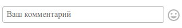
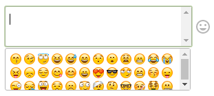
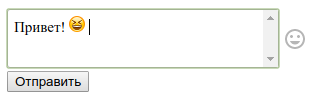

# Textareasmiles плагин для CakePHP

Плагин для cakePHP, который выводит форму ввода текста с возможность вставки смайликов.







## Инсталяция

Вы можете установить этот плагин в свое приложение CakePHP с помощью [composer](https://getcomposer.org).

Установка плагина:

```
$ sudo composer require valeriy-brunov/textareasmiles
$ sudo composer dumpautoload
```

#### Инициализация элемента

В шаблоне с расширением .ctp необходимо вставить код:

```php
echo $this->element('Textareasmiles.formtextareasmiles');
```

Полный перечень дополнительных настроек элемента.

```js
Необязательные параметры:
@param {string} $id_wrap
	id обёртки.
@param {string} $add_wrap_class
	Перечень дополнительных классов через пробел.
@param {string} $id_submit
	id кнопки.
@param {string} $name_submit
	Имя кнопки, которое будет передано на сервер. Имя кнопки по умолчанию "mytext".
@param {string} $value_submit
	Надпись на кнопке. Надпись по умолчанию "Отправить".
@param {string} $add_submit_class
	Перечень дополнительных классов через пробел.
```

Далее необходимо инициализация js виджета. Для минимальной инициализации необходимо указать только адрес запроса AJAX кода:

```js
$( 'div.wrap-textarea-smiles' ).textareasmiles({'urlAJAX': 'Адрес запроса AJAX кода'});
```

Полный список настроек по умолчанию:

```js
@param {int} k
	Коэффициент высоты текстового поля, когда оно находится в фокусе.
@param {int} height_box_smiles
	Высота панели в "px" со смайлами.
@param {string} urlAJAX
	Адрес запроса AJAX кода.
@param {string} method
	Метод отправки данных на сервер ( GET|POST ).
@param {string} datatype
	Тип возвращаемого объекта AJAX-кодом ( html|json|xml|script|text ).
@param {string} openside
    В какую сторону раскрывать панель со смайликами (bottom|top|auto).
```

#### Описание работы виджета.
При нажатие кнопки "Отправить" текст из текстового поля сохраняется в объект `window.datatextareasmiles.text`, далее передаётся при помощи AJAX на сервер. Вы можете в объект `window.datatextareasmiles` добавить свои значения, которые будут переданы на сервер. Например, чтобы передать вместе с текстом из тектового поля значение id на сервер, необходимо до нажатия кнопки "Отправить" установить значение `window.datatextareasmiles.id`.

Данный виджет создаёт два события:

1. Событие **beforesendtextareasmiles** до отправки сообщения на сервер;
2. Событие **successfullysendtextareasmiles** после успешного получения ответа от сервера.

```js
$( document )
.on( 'beforesendtextareasmiles', { this_: this }, function( event ) {
	// Событие сработает до отправки сообщения на сервер.
})
.on( 'successfullysendtextareasmiles', { this_: this }, function( event, data ) {
	// Событие сработает после успешного получения ответа от сервера.
	// data - данные, полученные от сервера.
});
```

#### Живой пример на jsfiddle

https://jsfiddle.net/ValeriyBrunov/q9b6zL2t/


